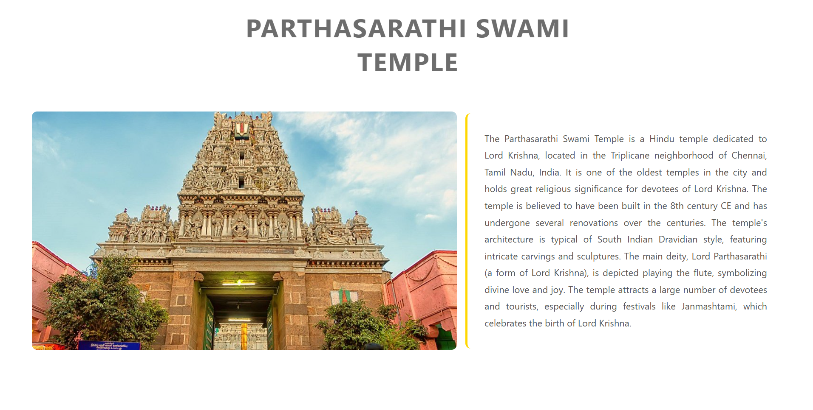
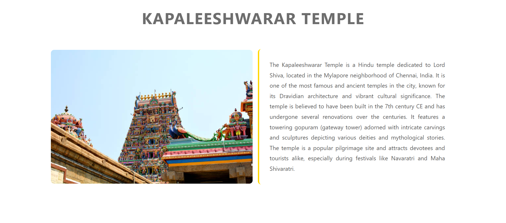
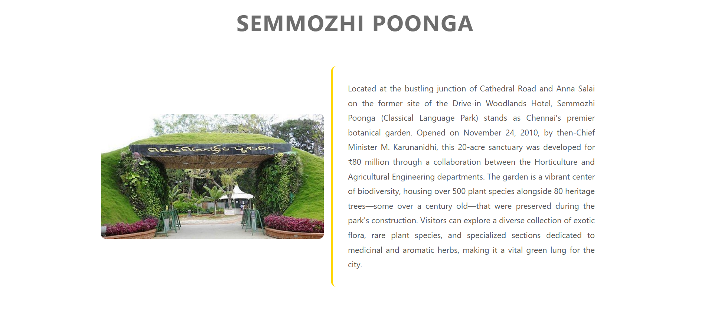
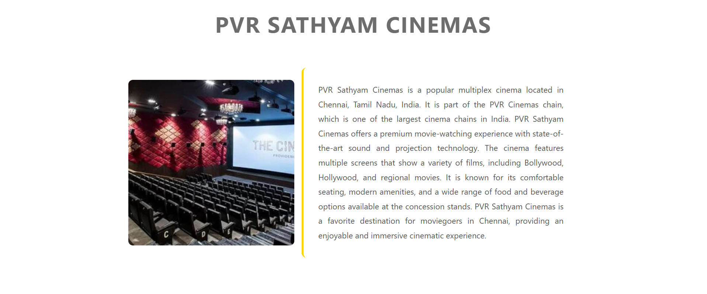
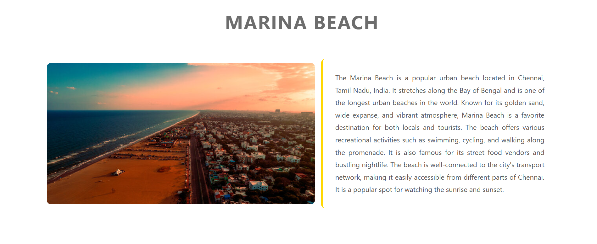

# Ex03 Places Around Me

## Date: 10-02-2026

## AIM

To develop a website to display details about the places around my house.

## DESIGN STEPS

### STEP 1

Create a Django admin interface.

### STEP 2

Download your city map from Google.

### STEP 3

Using `<map>` tag name the map.

### STEP 4

Create clickable regions in the image using `<area>` tag.

### STEP 5

Write HTML programs for all the regions identified.

### STEP 6

Execute the programs and publish them.

## CODE

### index.html

```html
<!doctype html>
<html lang="en">
  <head>
    <meta charset="UTF-8" />
    <meta name="viewport" content="width=device-width, initial-scale=1.0" />
    <link rel="stylesheet" href="index.css" />
    <title>Chennai</title>
  </head>
  <body>
    <section class="title">
      <h2>Chennai</h2>
      <h1>Some must visit spots</h1>
    </section>
    <section class="imageMap">
      

      <map name="image-map">
        <area
          alt="Parthasarathi Swami Temple"
          title="Parthasarathi Swami Temple"
          href="./Parthasarathi.html"
          coords="719,97,904,194"
          shape="rect"
        />
        <area
          alt="Semmozhi Poonga"
          title="Semmozhi Poonga"
          href="./SemmozhiPoonga.html"
          coords="118,245,77"
          shape="circle"
        />
        <area
          alt="Kapaleeshwara Swami Temple"
          title="Kapaleeshwara Swami Temple"
          href="./kapaleeshwarar.html"
          coords="560,659,827,753"
          shape="rect"
        />
        <area
          alt="PVR Sathyam Cinemas"
          title="PVR Sathyam Cinemas"
          href="./PVR.html"
          coords="110,48,317,143"
          shape="rect"
        />
        <area
          alt="Marina Beach"
          title="Marina Beach"
          href="./Marina.html"
          coords="889,765,906,563,886,553,970,22,1068,24,1004,265,938,517,899,768"
          shape="poly"
        />
      </map>
    </section>
  </body>
</html>
```

### kapaleeshwarar.html

```html
<!doctype html>
<html lang="en">
  <head>
    <meta charset="UTF-8" />
    <meta name="viewport" content="width=device-width, initial-scale=1.0" />
    <link rel="stylesheet" href="style.css" />
    <title>Kapaleeshwarar Temple</title>
  </head>
  <body>
    <h1 class="heading">Kapaleeshwarar Temple</h1>
    <div class="main">
      
      <p class="description">
        The Kapaleeshwarar Temple is a Hindu temple dedicated to Lord Shiva,
        located in the Mylapore neighborhood of Chennai, India. It is one of the
        most famous and ancient temples in the city, known for its Dravidian
        architecture and vibrant cultural significance. The temple is believed
        to have been built in the 7th century CE and has undergone several
        renovations over the centuries. It features a towering gopuram (gateway
        tower) adorned with intricate carvings and sculptures depicting various
        deities and mythological stories. The temple is a popular pilgrimage
        site and attracts devotees and tourists alike, especially during
        festivals like Navaratri and Maha Shivaratri.
      </p>
    </div>
  </body>
</html>
```

### Parthasarathi.html

```html
<!doctype html>
<html lang="en">
  <head>
    <meta charset="UTF-8" />
    <meta name="viewport" content="width=device-width, initial-scale=1.0" />
    <link rel="stylesheet" href="style.css" />
    <title>ParthaSarathi Swami Temple</title>
  </head>
  <body>
    <h1 class="heading">Parthasarathi Swami Temple</h1>
    <div class="main">
      
      <p class="description">
        The Parthasarathi Swami Temple is a Hindu temple dedicated to Lord
        Krishna, located in the Triplicane neighborhood of Chennai, Tamil Nadu,
        India. It is one of the oldest temples in the city and holds great
        religious significance for devotees of Lord Krishna. The temple is
        believed to have been built in the 8th century CE and has undergone
        several renovations over the centuries. The temple's architecture is
        typical of South Indian Dravidian style, featuring intricate carvings
        and sculptures. The main deity, Lord Parthasarathi (a form of Lord
        Krishna), is depicted playing the flute, symbolizing divine love and
        joy. The temple attracts a large number of devotees and tourists,
        especially during festivals like Janmashtami, which celebrates the birth
        of Lord Krishna.
      </p>
    </div>
  </body>
</html>
```

### Marina.html

```html
<!doctype html>
<html lang="en">
  <head>
    <meta charset="UTF-8" />
    <meta name="viewport" content="width=device-width, initial-scale=1.0" />
    <link rel="stylesheet" href="style.css" />
    <title>Marina Beach</title>
  </head>
  <body>
    <h1 class="heading">Marina Beach</h1>
    <div class="main">
      
      <p class="description">
        The Marina Beach is a popular urban beach located in Chennai, Tamil
        Nadu, India. It stretches along the Bay of Bengal and is one of the
        longest urban beaches in the world. Known for its golden sand, wide
        expanse, and vibrant atmosphere, Marina Beach is a favorite destination
        for both locals and tourists. The beach offers various recreational
        activities such as swimming, cycling, and walking along the promenade.
        It is also famous for its street food vendors and bustling nightlife.
        The beach is well-connected to the city's transport network, making it
        easily accessible from different parts of Chennai. It is a popular spot
        for watching the sunrise and sunset.
      </p>
    </div>
  </body>
</html>
```

### PVR.html

```html
<!doctype html>
<html lang="en">
  <head>
    <meta charset="UTF-8" />
    <meta name="viewport" content="width=device-width, initial-scale=1.0" />
    <link rel="stylesheet" href="style.css" />
    <title>PVR Sathyam Cinemas</title>
  </head>
  <body>
    <h1 class="heading">PVR Sathyam Cinemas</h1>
    <div class="main">
      
      <p class="description">
        PVR Sathyam Cinemas is a popular multiplex cinema located in Chennai,
        Tamil Nadu, India. It is part of the PVR Cinemas chain, which is one of
        the largest cinema chains in India. PVR Sathyam Cinemas offers a premium
        movie-watching experience with state-of-the-art sound and projection
        technology. The cinema features multiple screens that show a variety of
        films, including Bollywood, Hollywood, and regional movies. It is known
        for its comfortable seating, modern amenities, and a wide range of food
        and beverage options available at the concession stands. PVR Sathyam
        Cinemas is a favorite destination for moviegoers in Chennai, providing
        an enjoyable and immersive cinematic experience.
      </p>
    </div>
  </body>
</html>
```

### SemmozhiPoonga.html

```html
<!doctype html>
<html lang="en">
  <head>
    <meta charset="UTF-8" />
    <meta name="viewport" content="width=device-width, initial-scale=1.0" />
    <link rel="stylesheet" href="style.css" />
    <title>Semmozhi Poonga</title>
  </head>
  <body>
    <h1 class="heading">Semmozhi Poonga</h1>
    <div class="main">
      
      <p class="description">
        Located at the bustling junction of Cathedral Road and Anna Salai on the
        former site of the Drive-in Woodlands Hotel, Semmozhi Poonga (Classical
        Language Park) stands as Chennai's premier botanical garden. Opened on
        November 24, 2010, by then-Chief Minister M. Karunanidhi, this 20-acre
        sanctuary was developed for ₹80 million through a collaboration between
        the Horticulture and Agricultural Engineering departments. The garden is
        a vibrant center of biodiversity, housing over 500 plant species
        alongside 80 heritage trees—some over a century old—that were preserved
        during the park's construction. Visitors can explore a diverse
        collection of exotic flora, rare plant species, and specialized sections
        dedicated to medicinal and aromatic herbs, making it a vital green lung
        for the city.
      </p>
    </div>
  </body>
</html>
```

## OUTPUT

### Main Map:


### Parthasarathi Temple:



### Kapaleeshwara Swami Temple:



### Semmozhi Poonga:



### PVR Sathyam Cinemas:



### Marina Beach:



## RESULT

The program for implementing image maps using HTML is executed successfully.


Name : ASWIN B \
Register Number : 212224110007
